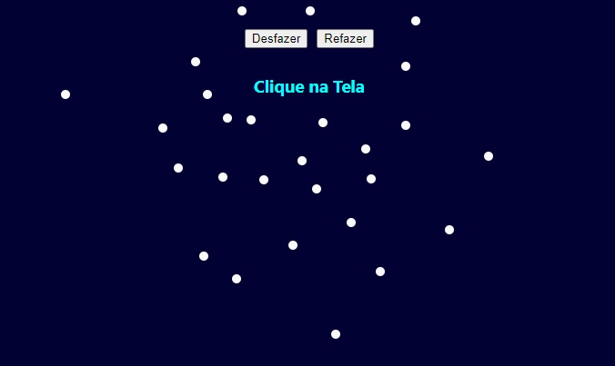

# Dot Marker

Marcador de Cliques - práticad de ReactJs useState() 

[Clique para acessar](https://dot-marker.vercel.app/)

## Funcionalidades:
- Marcação de clique na tela
- Botão de Desfazer (apaga a marcação do último clique)
- Botão de Refazer (Remarca a ultima marcação apagada)

## Tecnologia
- ReactJs (hook useState)
- HTML
- CSS
- JavaScript
